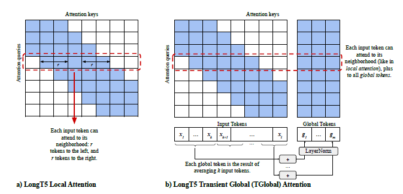

# Text Summarization Using LongT5 on PubMed Dataset

This project demonstrates abstractive text summarization on the PubMed dataset using the [LongT5](https://arxiv.org/abs/2112.07916) transformer model with global attention, leveraging the Hugging Face Transformers and Datasets libraries.
This is an experimentation project attempted to explore the text summarization task and reproduce the results obtained in the original work by Guo, M and the team from Google that developed the Long T5 base model with the Tglobal attention mechanism. Considering the limitations of the computation resources and time, the evaluation was constrained to only 1000 test records of the PubMed Dataset, which took about 3 hours to obtain the results using T4 GPU.

## Overview

The research work by Guo et al., (2022) presents the original implementation of the LongT5 model and discusses in detail its architectural design and salient differences from the base T5 (Text-to-Text Transfer Transformer) model. It also provides a detailed description of the experimental setup and the values of parameters for fine-tuning and compares the performance differences between the different models with a specific focus on two main tasks – text summarization and question-answering. For learning purposes, in the current experimentation, LongT5’s model performance for only text summarization on the PubMed dataset has been considered and attempted. On the contrary, the research work investigates the model performance on a variety of benchmark datasets, including arXiv, PubMed, BigPatent, MediaSum, CNN/Daily Mail and Multi-News for summarization and NQ (Natural Questions) and Trivia QA for QA tasks. Furthermore, for each of the use cases, the model’s performance was compared with other approaches using T5, PEGASUS, HART-BART, PRIMER etc, to showcase the exceptional results attained using LongT5 for processing long input text sequences. The understanding of the LongT5 model design that enables it to outperform the other state-of-the-art models has been discussed in detail in the following section. From reviewing the research article, it becomes clear that LongT5 is basically a scalable version of the T5 model that incorporates an attention mechanism from long-input transformers and a pre-training strategy from PEGASUS.

- **Model:** `google/long-t5-tglobal-base` (pre-trained)
- **Dataset:** [ccdv/pubmed-summarization](https://huggingface.co/datasets/ccdv/pubmed-summarization)
- **Task:** Generate concise summaries (abstracts) from long biomedical articles.
- **Evaluation:** ROUGE metrics on 1000 test records.

## LongT5 Architecture

As the name suggests, LongT5 can be seen as a modified version of the versatile T5 (Text-to-Text Transfer Transformer) model that can be used for a variety of NLP tasks, including text summarization, QA, text classification etc. The core modification in the design of LongT5 was a result of investigating the impact of concurrently scaling the input length and model size in the transformer architecture. This led to the integration of the following two main ideas into a scalable T5 model:
1. Adoption of long-input transformer attention
2. The Principle Sentences Generation pretraining strategy adopted in PEGASUS.

### Attention Mechanism
The main contribution towards the design of the LongT5 model to enable the handling of longer text sequences more efficiently is that of extending the T5 encoder with the Global-local attention with sparsity patterns as in the Extended Transformer Construction (ETC) to reduce the quadratic memory cost when increasing the scale of input sequences. However, to fit the architecture of T5, the ETC’s requirement of additional side inputs was removed. Therefore, in comparison to the regular T5 model, the LongT5 model now employs two variations of the attention mechanism, as illustrated in the figure below:


#### Local attention:
For local attention operation, the encoder in T5 for the self-attention operation is replaced with that of a sparse sliding window. This allows each input token to attend to the adjacent tokens, say r tokens to the left and r tokens to the right, as shown in the above figure. Further, since this does not introduce new parameters, the complexity is kept linear to the input sequence length.
#### Transient Global (TGlobal) attention:
For the Transient Global attention operation, to enable input tokens to interact with one another in each layer of the encoder at a larger range than the local radius r of local attention, the ETC's global-local attention in a "fixed blocks" pattern was modified. As a result, the input sequence is divided into k tokens blocks, and for each of the blocks, the global token is computed by summing and normalizing the embeddings of the tokens in the block, as shown in the above figure. Therefore, when computing attention, it allows each input token to not only attend to nearby tokens but also accommodate global tokens. Since these global tokens at each layer are synthesized dynamically, it is called transient global tokens, which allows the model to scale to larger input sequences and achieve notable performance improvements with only a slight performance degradation relative to full attention at the same input length.

### PEGASUS Principle Sentence Generation Pretraining
Based on the research finding that the prediction of more informative text tokens could lead to better learning of the semantics in the text by the model, the LongT5 design adopted the Gap Sentences Generation pre-training strategy of the PEGASUS, particularly for summarization. This enables the model to learn and predict the masked parts/missing sentences of the document and thereby capture the context and semantics of the text document efficiently, making it well-suited for abstractive summarization of long text sequence documents than the regular T5 model

### Strengths:
1. Firstly, from reviewing the original research article, it becomes clear that the longt5 model, despite having reduced attention, outperformed the regular T5 model and produced exceptional results for most of the text summarization datasets, including the PubMed5 dataset, which has longer text input sequences (scaling up to 16k tokens) and therefore considered for the current experiment. This has been attributed to the increase in the scale of input sequence length and the gap sentence generation strategy employed for pre-training. This makes it more efficient for abstractive summarization of long-text documents and leads to the below-highlighted advantages of the LongT5 model:
2. Scalability and ability to handle long text sequences:
The very design of the LongT5 model architecture, accommodating long input sequences of up to 16000 tokens, makes it suitable and ideal for processing and summarization of large text documents in contrast to the regular T5 model, which struggles when input is increased to 4k text sequences as T5 design is limited to only 512 tokens.
3. Efficient usage of memory:
The design of LongT5 employs a global-local attention mechanism in contrast to the full self-attention mechanism in the regular T5 model. This allows only selective unique tokens to attend the entire sequence (global attention), while the majority of the tokens pay attention to a narrow window of adjacent tokens (local attention). In comparison to the full self-attention mechanism in T5, where every token attends to every other token, leading to a quadratic memory growth, LongT5 makes efficient usage of memory, especially when considering long text documents.
4. Ability to maintain long-range dependencies:
With the global attention mechanism in place, it allows the LongT5 model to understand the entire document structure and capture the long-range dependencies that are critical for text summarization. On the other hand, in T5, if the input sequence is excessively long due to the sequence length restriction of the model, some long-range dependencies and, in turn, the context can be lost.

### Weaknesses:

1. Increased complexity:
With the attention mechanism incorporating both local and global attention, it introduces a bit of complexity in terms of optimizing or fine-tuning the model and results in the following drawback of demanding higher training time.
2. Higher Training time:
With the increased complexity and additional layers to handle long text sequences, which naturally take a longer time to process and compute the gradients, it results in a longer time for training and optimizing and consequently results in the next drawback of demanding high computational resources.
3. High Computational resources:
Due to its ability to handle long text sequences, which consequently require high processing and computational resources such as GPUs or TPUs, it becomes practically difficult to implement by users with limited hardware, despite being optimized for long inputs. This presents a significant practical issue, as it did throughout the current implementation.

## Implementation

- End-to-end pipeline: data loading, preprocessing, tokenization, inference, and evaluation.
- Handles long input sequences (up to 4096 tokens).
- Efficient inference with GPU support and memory optimization.
- Includes sample code for generating and evaluating summaries.

## Usage

1. **Install dependencies:**
    ```sh
    pip install torch transformers datasets evaluate rouge_score
    ```

2. **Run the notebook:**
    - Open `LongT5_summarization.ipynb` in Jupyter or VS Code.
    - Execute cells sequentially to:
        - Load the model and dataset
        - Tokenize and preprocess data
        - Evaluate model performance on test data
        - Generate summaries for sample articles

3. **Sample Inference:**
    ```python
    test_article = pubmed_dataset['test'][0]['article']
    summary = generate_summary(test_article)
    print(summary)
    ```

## Results

- **ROUGE-1:** ~29.16
- **ROUGE-2:** ~8.54
- **ROUGE-L:** ~16.74

These scores indicate the model captures key unigrams but has room for improvement in phrase and sequence coherence.

## References
Guo, M., Ainslie, J., Uthus, D. C., Ontañón, S., Ni, J., Sung, Y.-H., & Yang, Y. (2022). LongT5: Efficient Text-To-Text Transformer for Long Sequences. https://doi.org/10.18653/v1/2022.findings-naacl.55 

Summarization. (n.d.). Huggingface.co. https://huggingface.co/docs/transformers/en/tasks/summarization 

Synced. (2021, December 21). Google’s Transformer-Based LongT5 Achieves Performance Gains by Scaling Both Input Length and Model Size. Medium; SyncedReview. https://medium.com/syncedreview/googles-transformer-based-longt5-achieves-performance-gains-by-scaling-both-input-length-and-model-687afb8a3274

## Author

- Kamatchi Gnanavel
- AI/ML Engineer

---

*This project is part of my AI/ML engineering portfolio. For questions or collaboration, feel free to reach out!*


